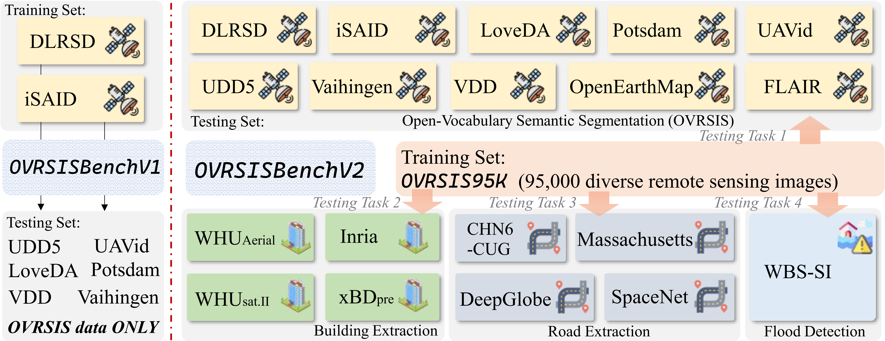

<div align="center">

# Open-Vocabulary Remote Sensing Segmentation  
## Foundation Dataset, Benchmark, and Model

**Official repository for OVRSISBenchV2 and Pi-Seg**

[](https://arxiv.org/pdf/2509.12040.pdf)
[](#ovrsisbenchv2)
[](#ovrsis95k)
[](#pi-seg)

[Hugging Face: OVRSIS95K](https://huggingface.co/datasets/kkk2026/OVRSIS95K) &nbsp;&nbsp;&nbsp;
[Hugging Face: OVRSISBenchV2_OVRSIS](https://huggingface.co/datasets/kkk2026/OVRSISBench_test) &nbsp;&nbsp;&nbsp;
[Hugging Face: OVRSISBenchV2_other3task](https://huggingface.co/datasets/kkk2026/OVRSISBenchV2_other3task)

</div>

---

## News
- **2026/03**: OVRSISBenchV2 resources are released.
- **2026/03**: OVRSIS95K is publicly available on Hugging Face.
- **2026/03**: Pi-Seg code branch for OVRSISBenchV2 is available.
- More checkpoints, scripts, and benchmark resources will be organized and released continuously.

---

## Overview
Open-Vocabulary Remote Sensing Image Segmentation (**OVRSIS**) extends open-vocabulary segmentation from natural images to the remote sensing domain. Instead of predicting masks only for a fixed closed-set label space, OVRSIS aims to segment **arbitrary semantic categories** specified by text prompts.

Compared with natural-image OVS, OVRSIS is much more challenging because remote sensing imagery contains:
- **large domain gaps** between natural-image pretraining and Earth observation scenes,
- **arbitrary object orientations** and **severe scale variation**,
- **small targets and dense layouts**,
- **fragmented evaluation settings** across datasets,
- **limited scene diversity and long-tail category imbalance**.

To address these challenges, this project focuses on three tightly coupled components:
- **OVRSIS95K**: a large-scale and balanced remote sensing segmentation dataset,
- **OVRSISBenchV2**: a unified and application-oriented benchmark for OVRSIS,
- **Pi-Seg**: a lightweight and effective baseline for robust open-vocabulary remote sensing segmentation.

---

## Why OVRSISBenchV2?
Our previous OVRSISBenchV1 established the first unified open-vocabulary benchmark for remote sensing segmentation. However, its training data scale and scene diversity were still limited, making it difficult to evaluate generalization in more realistic open-world scenarios.

**OVRSISBenchV2** extends V1 into a **large-scale, multi-domain, application-oriented research platform**. It is designed not only for standard OVRSIS evaluation, but also for more practical downstream remote sensing tasks.



### Key improvements of OVRSISBenchV2
- **170K+ annotated remote sensing images**,
- **132 semantic categories**,
- training built on **OVRSIS95K**,
- evaluation across **diverse satellite and UAV datasets**,
- additional downstream task protocols for:
  - **building extraction**,
  - **road extraction**,
  - **flood detection**.

This makes OVRSISBenchV2 a more realistic and more challenging benchmark for studying semantic generalization, cross-domain transfer, and application robustness.

---

## OVRSIS95K
To provide a stronger training foundation for OVRSIS, we construct **OVRSIS95K**, a large-scale and balanced remote sensing dataset with approximately **95K image-mask pairs** and **39 semantic categories**.


### Scene domains
OVRSIS95K covers five representative remote sensing scene types:
- **town**
- **industrial**
- **forest**
- **waterfront**
- **wasteland**

### Annotation pipeline
OVRSIS95K is built with a scalable semi-automated annotation pipeline that includes:
1. **caption-driven category generation**,  
2. **mask proposal extraction**,  
3. **human verification and correction**.

This design improves annotation efficiency while preserving category quality, semantic diversity, and class balance.


### Dataset links
- **OVRSIS95K**: [Hugging Face](https://huggingface.co/datasets/kkk2026/OVRSIS95K)
- **OVRSISBenchV2 (OVRSIS evaluation set)**: [Hugging Face](https://huggingface.co/datasets/kkk2026/OVRSISBench_test)
- **OVRSISBenchV2 (other three downstream tasks)**: [Hugging Face](https://huggingface.co/datasets/kkk2026/OVRSISBenchV2_other3task)

---

## OVRSISBenchV2
OVRSISBenchV2 unifies large-scale remote sensing data into a comprehensive benchmark for evaluating open-vocabulary segmentation under diverse imaging conditions.

### Benchmark characteristics
- **Training set**: OVRSIS95K
- **Evaluation target**: open-vocabulary segmentation on remote sensing datasets with partially disjoint category sets
- **Coverage**: satellite imagery, UAV imagery, multiple scene distributions, and heterogeneous spatial resolutions
- **Goal**: assess transferability to **unseen categories**, **novel domains**, and **real-world applications**

### Evaluation protocols
OVRSISBenchV2 supports two levels of evaluation:

#### 1. Standard OVRSIS evaluation
This protocol measures open-vocabulary semantic segmentation performance on downstream remote sensing datasets, focusing on semantic transfer to unseen categories.

#### 2. Downstream task-oriented evaluation
To bridge the gap between benchmark research and practical deployment, OVRSISBenchV2 further includes:
- **Building Extraction**
- **Road Extraction**
- **Flood Detection**

These protocols evaluate not only category generalization, but also task-level robustness in realistic geospatial scenarios.

---

## Pi-Seg
**Pi-Seg (Perturbation-Injected Segmentation)** is a lightweight yet effective framework designed for OVRSISBenchV2.

Unlike previous methods that rely heavily on multiple external pretrained encoders for remote sensing domain transfer, Pi-Seg improves generalization by learning a broader and more transferable feature space during training.

### Core idea
Pi-Seg introduces a **positive-incentive noise learning mechanism** that injects semantically guided perturbations into both:
- **visual features**, and
- **textual features**.

This stochastic training strategy encourages the model to learn smoother and more transferable decision boundaries, improving robustness to:
- **unseen semantic categories**,
- **domain shifts**,
- **complex remote sensing scenes**.

### Advantages of Pi-Seg
- **lighter design** than heavy multi-encoder transfer frameworks,
- **lower memory and computational cost**, 
- better support for **higher-resolution remote sensing inputs**,
- stronger **cross-domain generalization** on OVRSISBenchV1, OVRSISBenchV2, and downstream tasks.

---

## Resources
### Code
- **Pi-Seg branch**: [GitHub](https://github.com/LiBingyu01/FGA-seg/tree/Pi-Seg_OVRSISBenchV2)

### Datasets
- **OVRSIS95K**: [Hugging Face](https://huggingface.co/datasets/kkk2026/OVRSIS95K)
- **OVRSISBenchV2_OVRSIS**: [Hugging Face](https://huggingface.co/datasets/kkk2026/OVRSISBench_test)
- **OVRSISBenchV2_other3task**: [Hugging Face](https://huggingface.co/datasets/kkk2026/OVRSISBenchV2_other3task)

### Paper
- **ArXiv**: [Open-Vocabulary Remote Sensing Segmentation: Foundation Dataset, Benchmark and Model](https://arxiv.org/pdf/2509.12040.pdf)

---

## TODO
- [ ] Release more cleaned training and evaluation scripts.
- [ ] Organize model zoo and pretrained checkpoints.
- [ ] Add detailed installation and usage instructions.
- [ ] Add benchmark statistics and per-task evaluation examples.
- [ ] Continue improving documentation and community support.

---

## Contact
If you encounter any issues, find errors, or would like to contribute to this project, please feel free to open an issue or contact the authors by email:

- **libingyu0205@mail.ustc.edu.cn**

We sincerely welcome contributions from the community.

---

## Citation
If you find this repository useful, please cite:

```bibtex
@article{li2026ovrsisbenchv2,
  title={Open-Vocabulary Remote Sensing Segmentation: Foundation Dataset, Benchmark and Model},
  author={Li, Bingyu and Huo, Tao and Zhang, Da and Dong, Haocheng and Chen, Lin and Zhao, Zhiyuan and Gao, Junyu and Li, Xuelong},
  journal={arXiv preprint arXiv:2509.12040},
  year={2026}
}
```

---

## Acknowledgement
We sincerely appreciate the valuable contributions of the open-source community. This project benefits from a number of excellent prior works and datasets, including but not limited to:

- [Detectron2](https://github.com/facebookresearch/detectron2)
- [CAT-Seg](https://github.com/cvlab-kaist/CAT-Seg)
- [OVRS](https://github.com/caoql98/OVRS)
- [GSNet](https://github.com/yecy749/GSNet)
- [SAMRS](https://github.com/ViTAE-Transformer/SAMRS)
- [LoveDA](https://github.com/Junjue-Wang/LoveDA)

---

## Star History
[](https://www.star-history.com/#LiBingyu01/FGA-seg&Date)
